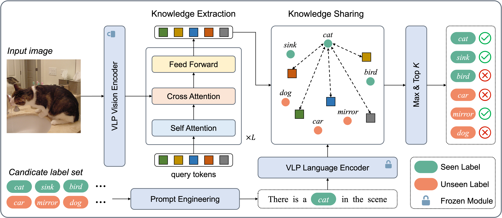

## Query-Based Knowledge Sharing for Open-Vocabulary Multi-Label Classification

### Introduction
This is an official PyTorch implementation of Query-Based Knowledge Sharing for Open-Vocabulary Multi-Label Classification, ACM Transactions on Multimedia Computing, Communications, and Applications. [[paper]](https://dl.acm.org/doi/10.1145/3762195)




### Data Preparation
1. Download dataset and organize them as follow:
```
|datasets
|---- NUS-WIDE
|-------- Flickr
|-------- Groundtruth
|-------- ImageList
|-------- NUS_WID_Tags
|-------- Concepts81.txt
|---- OpenImages
|-------- 2018_04
|------------ class-descriptions.csv
|------------ classes-trainable.txt
|------------ test
|---------------- annotations-human.csv
|---------------- images.csv
|---------------- test-annotations-human-imagelabels.csv
|------------ top_400_unseen.csv
|------------ train
|---------------- annotations-human.csv
|---------------- images.csv
|---------------- train-annotations-human-imagelabels.csv
|------------ unseen_labels.pkl
|------------ validation
|---------------- annotations-human.csv
|---------------- images.csv
|---------------- validation-annotations-human-imagelabels.csv
```

2. Preprocess using following commands:
```bash
python scripts/nuswide.py
python scripts/download.py --mode [train, validation, test] --num-workers 32  # dowload image data for Open Images
python scripts/openimages.py
```

### Requirements
```
torch >= 1.12.0
torchvision >= 0.13.0
```

### Training
One can use following commands to train model and reproduce the results reported in paper.
```bash
python train.py --model qks --data nuswide --num-hidden-layer 7 --lr-scheduler ReduceLROnPlateau --lr 0.00001 --loss asl --num-query-tokens 12 --gamma-neg 4.0
python train.py --model qks --data openimages --num-hidden-layer 8 --lr-scheduler ReduceLROnPlateau --lr 0.00001 --loss bce --num-query-tokens 22 --gamma-neg 4.0 --topk 10 20
```

### Evaluation

Pre-trained models are available in [link](https://pan.seu.edu.cn:443/link/3C5AF12C13775D0C195EB35D4AFB6CB9). Download and put them in the `experiments` folder, then one can use following commands to reproduce results reported in paper.
```bash
python evaluate.py --exp-dir experiments/qks_nuswide/exp1  # evaluation for NUS-WIDE
python evaluate.py --exp-dir experiments/qks_openimages/exp1  # evaluation for Open Images
```

### Citation
```

```
